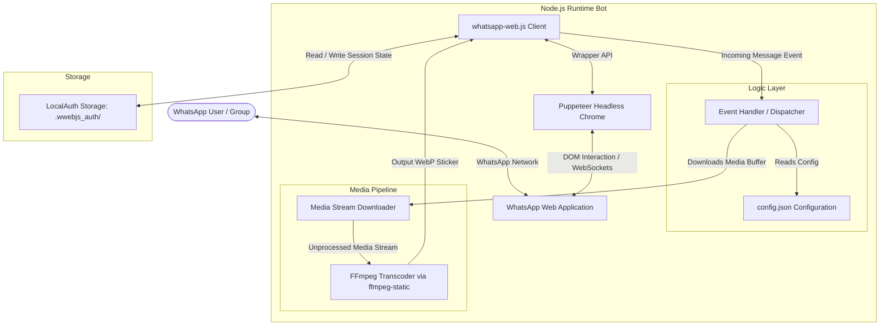
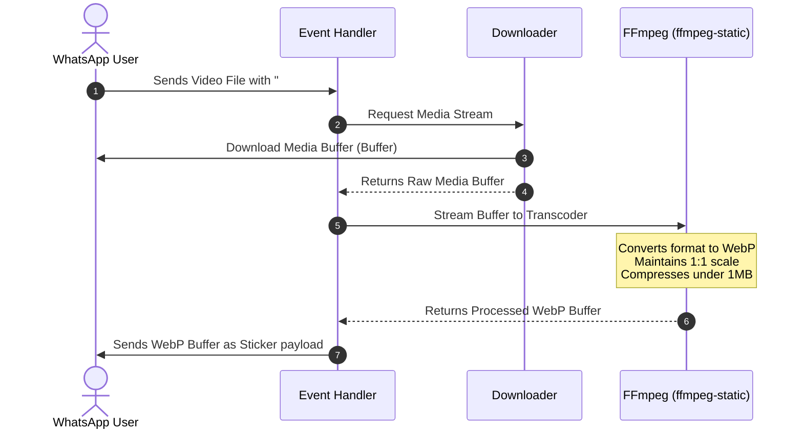

# System Architecture Specification

This document details the software architecture, execution flow, component structure, and media processing pipeline for the **Sticker WhatsApp Bot**.

---

## 🏗️ High-Level System Architecture

The application is built on an asynchronous, event-driven architecture using Node.js. It interfaces with WhatsApp's network via web-scraping and automated browser orchestration rather than relying on the official, restricted WhatsApp Business Cloud API.



---

## 🧩 Architectural Components

### 1. Client Layer (`whatsapp-web.js`)
* **Purpose:** Serves as the high-level interface interacting with WhatsApp Web.
* **Orchestration:** Spawns a Chromium web-browser instance controlled programmatically via Puppeteer. It injects custom JavaScript code into the WhatsApp Web DOM to capture socket actions, intercept incoming messages, and programmatically invoke outgoing media transmissions.
* **Authentication Manager (`LocalAuth`):** Saves session credentials (tokens, localStorage, cookies) inside a persistent local directory (`.wwebjs_auth/`). On startup, the client checks this folder to restore active sessions automatically without requiring re-scanning of the QR code.

### 2. Message Dispatcher & Command Parser
* **Event Loop:** Listens for the standard `message` events emitted by the client wrapper.
* **Filters:**
  * Categorizes messages by type (`image`, `video`, `gif`, `sticker`, `text`).
  * Validates whether the message originates from a direct chat or a group chat and matches the configuration settings.
* **Dynamic Routing:** Directs message commands based on message body prefixes (e.g., `#sticker`, `#image`, `#change`).

### 3. Media Processing Pipeline (FFmpeg Integration)
The core utility of this bot is transcoding standard images and videos into WhatsApp-compliant stickers. 

#### WhatsApp Sticker Constraints:
* Must be in **WebP** format.
* Must not exceed **1 MB** in size (especially critical for animated sticker loops).
* Must have an aspect ratio of exactly **1:1** (square).

#### Transcoding Flow:


---

## 🗄️ File and Project Layout

Below is the conceptual layout of the project, showcasing the boundaries between configuration, storage, logs, and application source code:

```
├── .wwebjs_auth/          # [Auto-Generated] Secure local session storage
├── config/
│   ├── config.json        # User/bot configuration, timezone, prefix, flags
│   └── console.txt        # Welcome ASCII banner printed on startup
├── docs/
│   ├── design_docs/
│   │   └── 00_milestone_summary.md # Detailed development roadmap
│   └── architecture.md    # System Architecture Specification (This Document)
├── index.js               # Application Entry Point & Core Event Loops
├── package.json           # Node.js dependency and script manifests
└── .gitignore             # Version control exclusions (sessions, logs, temp files)
```

---

## 🔒 Security Design Controls

1. **Static Binary Sandbox Elimination:**
   * Removed untrusted pre-compiled `.exe` binaries from the workspace root to prevent potential supply chain attacks.
   * Relies on standard package distribution channels (`ffmpeg-static`) for fetching clean, OS-compliant binaries.
2. **Headless Chrome Sandboxing:**
   * Headless Chrome runs inside a secure local sandbox by default.
   * If running in restrictive environments (e.g., Docker containers or Linux distributions lacking GUI libraries), careful container-level sandbox settings should be applied instead of disabling security flags globally.
3. **Session Data Privacy:**
   * Session tokens are stored strictly within the local `.wwebjs_auth/` directory, which is excluded from Git tracking via `.gitignore`. This prevents sensitive authentication keys from ever leaking into remote version control repositories.
