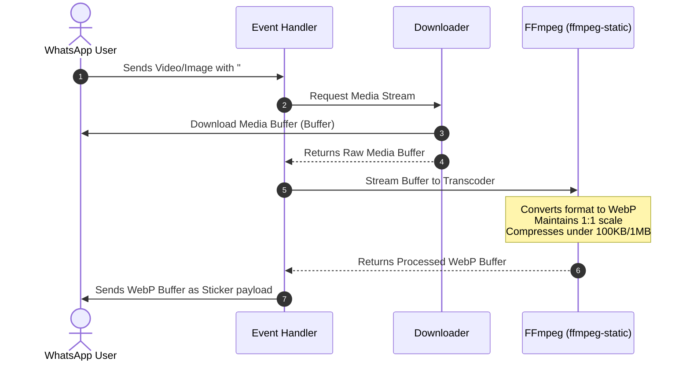

# System Architecture Specification

This document details the software architecture, execution flow, component structure, and media processing pipeline for the **Sticker WhatsApp Bot**.

---

## 🏗️ High-Level System Architecture

The application is built on an asynchronous, event-driven architecture using Node.js. It implements a **Dual-Mode Bootstrapper Architecture** allowing seamless operation in two modes:
1. **`web-automation`**: Automated browser session orchestration via Puppeteer.
2. **`official-api`**: High-efficiency, stateless webhook servicing via Meta Cloud Graph APIs.

```mermaid
graph TD
    User([WhatsApp Contact]) <-->|WhatsApp Protocol| WANet[WhatsApp Network]
    
    subgraph Meta Web Service (official-api)
        WANet <-->|HTTPS Webhooks / CDN| Express[Express Webhook Listener]
        Express <-->|officialEngine.js Service| MetaGraph[Meta Graph API / CDN Connector]
    end

    subgraph Browser Web Automation (web-automation)
        WANet <-->|WebSockets / DOM| Puppeteer[Puppeteer Headless Chrome]
        Puppeteer <-->|Wrapper API| WWebJS[whatsapp-web.js Client]
    end

    subgraph Node.js Runtime Bot
        ClientRouter[client.js Client Router]
        Express -->|Mock message event| ClientRouter
        WWebJS -->|Native message event| ClientRouter
        
        subgraph Logic Layer
            EventDispatcher[Event Handler / Dispatcher]
            ConfigManager[config.js Config Resolver]
            MessageCache[In-Memory messageCache]
        end
        
        subgraph Media Pipeline
            Downloader[Media Downloader / CDN Fetcher]
            Transcoder[FFmpeg Transcoder via ffmpeg-static]
        end
        
        ClientRouter -->|Incoming Message Event| EventDispatcher
        EventDispatcher -->|Reads Config| ConfigManager
        EventDispatcher -->|Lookups Context| MessageCache
        EventDispatcher -->|Downloads Buffer| Downloader
        Downloader -->|Raw Buffer| Transcoder
        Transcoder -->|Output WebP Sticker| ClientRouter
    end
    
    subgraph Storage
        SessionDir[LocalAuth Storage: .wwebjs_auth/]
    end
    
    WWebJS <-->|Read / Write Session State| SessionDir
```

---

## 🧩 Architectural Components

### 1. Dual-Client Routing Layer (`src/client.js`)
* **Purpose**: Serves as the unified interface wrapping both WhatsApp Web browser automations and Meta Graph webhook events. It implements a standard Node.js `EventEmitter` API with matching methods (`initialize`, `sendMessage`, `getChatById`), ensuring core commands are completely agnostic to the underlying transport mode.
* **`web-automation` Component**: Spawns a Chromium web-browser instance controlled programmatically via Puppeteer. It uses the `LocalAuth` strategy to save local session credentials securely under `.wwebjs_auth/`.
* **`official-api` Component**: Initializes an Express application that exposes:
  * `GET /webhook`: Verification challenge route used by Meta Graph API configurations.
  * `POST /webhook`: Handles asynchronous JSON notifications, routing inbound messages, image attachments, stickers, and documents.
  * **In-Memory cache**: Houses recent messages to cleanly reconstruct parent/quoted reference details during command flows.

### 2. Message Dispatcher & Command Parser (`src/handlers/messageHandler.js`)
* **Event Loop**: Listens for the standard `message` events emitted by the client wrapper.
* **Filters**:
  * Categorizes messages by type (`image`, `video`, `gif`, `sticker`, `text`).
  * Validates group/private constraints and matches operational commands.
* **Dynamic Routing**: Directs message commands based on message body prefixes (e.g., `#sticker`, `#image`, `#change`).

### 3. Media Processing Pipeline (FFmpeg Integration)
The core utility of this bot is transcoding standard images and videos into WhatsApp-compliant stickers. 

#### WhatsApp Sticker Constraints:
* Must be in **WebP** format.
* Must not exceed **1 MB** in size (automated browser mode) or strictly **100 KB** (official cloud API upload limit).
* Must have an aspect ratio of exactly **1:1** (square).

#### Transcoding Flow:


---

## 🗄️ File and Project Layout

Below is the conceptual layout of the project, showcasing the boundaries between configuration, storage, logs, and application source code:

```
├── .wwebjs_auth/          # [Auto-Generated] Secure local session storage
├── config/
│   ├── config.json        # User/bot configuration, timezone, prefix, flags
│   └── console.txt        # Welcome ASCII banner printed on startup
├── docs/
│   ├── design_docs/
│   │   ├── 00_milestone_summary.md # Detailed development roadmap
│   │   └── 01_reliability_and_fixes.md # Stability specification draft
│   └── architecture.md    # System Architecture Specification (This Document)
├── src/
│   ├── config.js          # Unified environment resolver
│   ├── client.js          # Dual-Mode Client Bootstrapper
│   ├── utils/
│   │   └── logger.js      # Color-coded timezoned logging helper
│   ├── handlers/
│   │   └── messageHandler.js # Message router dispatcher
│   ├── services/
│   │   └── officialEngine.js # Official Cloud Graph API connector helper
│   └── commands/
│       ├── sticker.js     # Media-to-sticker command
│       ├── image.js       # Sticker-to-image command
│       └── change.js      # Sticker metadata change command
├── index.js               # Minimal entry point (9-line bootstrapper)
├── package.json           # Node.js dependency and script manifests
└── .gitignore             # Version control exclusions (.env, sessions, node_modules)
```

---

## 🔒 Security Design Controls

1. **Environment Secrets Protection (`.env`)**:
   * Critical Meta Graph access tokens (`META_ACCESS_TOKEN`), endpoint configuration details (`META_PHONE_NUMBER_ID`), and local listening settings are secured inside dynamic environmental scopes. 
   * Local `.env` files are strictly excluded from version control systems via `.gitignore` to prevent any remote leakages.
2. **Static Binary Sandbox Elimination**:
   * Removed untrusted pre-compiled `.exe` binaries from the workspace root to prevent potential supply chain attacks.
   * Relies on standard package distribution channels (`ffmpeg-static`) for fetching clean, OS-compliant binaries.
3. **Headless Chrome Sandboxing**:
   * Headless Chrome runs inside a secure local sandbox by default.
   * If running in restrictive environments (e.g., Docker containers or Linux distributions lacking GUI libraries), careful container-level sandbox settings should be applied instead of disabling security flags globally.
4. **Session Data Privacy**:
   * Session tokens are stored strictly within the local `.wwebjs_auth/` directory, which is excluded from Git tracking via `.gitignore`. This prevents sensitive authentication keys from ever leaking into remote version control repositories.
