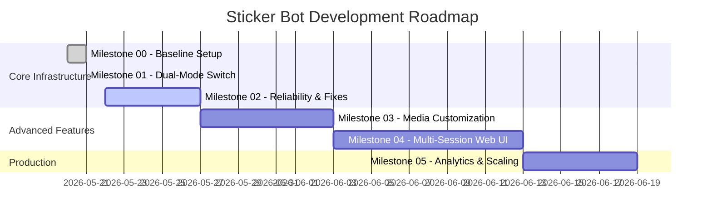

# Milestone Summary & Roadmap

This document serves as the high-level roadmap and design directory for the **Sticker WhatsApp Bot** project. It outlines past completions, current status, and strategic engineering milestones aimed at enhancing the bot's features, scalability, and performance.

---

## 📅 Roadmap Overview

---

## 🚀 Milestones

### [00] Core Cleanup & Codebase Modularization
* **Status:** Completed ✅
* **Scope:** 
  * **Dependency Audit & Fixes:** Cleaned up core project vulnerabilities using `npm audit` to update deprecated deep dependencies.
  * **Dynamic Transcoder Integration:** Migrated from a local Windows-restricted `ffmpeg.exe` binary to the platform-agnostic, automated `ffmpeg-static` package.
  * **Architectural Refactoring:** Modularized the single monolithic `index.js` into an clean Command Pattern directory (`src/`):
    * Decoupled server setups (`src/client.js`)
    * Dynamic command routers (`src/handlers/messageHandler.js`)
    * Isolated command utilities (`src/commands/`)
    * Color-coded centralized logging helper (`src/utils/logger.js`)
  * **Exclusion Optimization:** Optimized git exclusions, tracking configurations, and manifests (`.gitignore`, `package.json`).

### [01] Dual-Mode Switch & Official API Integration
* **Status:** Completed ✅
* **Scope:**
  * **Environment Secret Controls**: Integrates `dotenv` and standardizes credential management via local `.env` and GitHub Secrets.
  * **Unified Config Resolver**: Developed `src/config.js` merging static `config.json` with environment variables.
  * **Official WhatsApp Cloud API**: Created `src/services/officialEngine.js` for media down/up streaming and Graph API message delivery.
  * **Stateless Webhook Server**: Configured the client bootstrapping layers inside `src/client.js` to optionally stand up an Express server with verification challenge handling, in-memory caching for quoted messaging context routing, and unified event emissions.

### [02] Reliability & Stability Upgrades
* **Status:** Planned 📅
* **Scope:**
  * **Puppeteer Resource Tuning:** Set up automatic browser context recycling to avoid memory leaks commonly associated with long-running headless Chrome instances.
  * **Resilient Re-authentication:** Create a robust handler to automatically recover from session drops (`restartOnAuthFail`) and notify administrators of authentication actions.
  * **Advanced Error Handling:** Implement try-catch blocks around download streams to prevent unhandled promise rejections when users send corrupted media.

### [03] Rich Media Processing & Sticker Filters
* **Status:** Planned 📅
* **Scope:**
  * **Image Cropping & Manipulation:** Allow users to pass commands like `#sticker crop` or `#sticker circle` using `sharp` or `jimp` to auto-mask images.
  * **Text Overlays (Meme Generator):** Add functionality to overlay custom text onto images/GIFs before converting them to stickers.
  * **Video Optimization:** Fine-tune FFmpeg options to optimize output file size, ensuring all moving stickers remain strictly under WhatsApp's 1MB file limit.

### [04] Multi-Session Client Manager
* **Status:** Planned 📅
* **Scope:**
  * **Multi-Client Architecture:** Restructure the code to manage multiple instances of the WhatsApp `Client` concurrently, allowing different users/numbers to connect their own bots.
  * **Web Dashboard:** Build a sleek, responsive Next.js/Vite dashboard allowing administrators to monitor bot status, scan QR codes, and see live service logs.

### [05] Analytics & Performance Monitoring
* **Status:** Planned 📅
* **Scope:**
  * **Usage Tracking:** Maintain lightweight storage (SQLite or LevelDB) recording stickers created per user/group for analytics.
  * **Rate Limiting:** Implement token-bucket rate limiting to prevent spamming attacks from heavy group chats.
  * **System Telemetry:** Export execution metrics (CPU/RAM usage, execution time per sticker conversion) to keep track of host server health.

---

## 📂 Document Directory

Subsequent architecture specifications will be located in this directory:

| Filename | Description | Status |
| :--- | :--- | :--- |
| `00_milestone_summary.md` | Overall roadmap, core cleanup results, and future plan summary. | **Current** |
| `01_dual_mode_official_integration.md` | Completed specifications for webhook cache layers, environment resolver and Meta Graph APIs. | **Completed** |
| `02_reliability_and_fixes.md` | Technical design for memory management, Puppeteer pooling, and crash recovery. | *Drafted* |
| `03_media_customization.md` | Image-processing pipeline specs using `sharp` and advanced `ffmpeg` parameters. | *Planned* |
| `04_multi_session_manager.md` | Architecture details for running concurrent clients and setting up a web UI. | *Planned* |
| `05_analytics_and_monitoring.md` | Telemetry, storage schema, rate-limiting models, and production scaling. | *Planned* |
